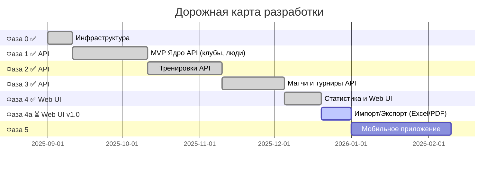

# Дорожная карта — «Сбор» (sbor.team)

> MVP Web → MVP Mobile → Полная платформа v2.0

---

## Общая шкала времени

---

## Фаза 0: Подготовка инфраструктуры (2 недели) ✅ ВЫПОЛНЕНО — 2025-09-01..2025-09-15

| Задача                                           | Дата выполнения | Статус |
|--------------------------------------------------|-----------------|--------|
| Инфраструктура: сервер, БД PostgreSQL, CI/CD, S3 | 2025-09-10      | ✅      |
| Laravel: структура проекта, Sanctum, роли, RBAC  | 2025-09-12      | ✅      |
| PostgreSQL: миграции Schema 1 + 2 + 3            | 2025-09-15      | ✅      |

**Результат:** Рабочий сервер с Laravel и настроенной БД. ✅

---

## Фаза 1: MVP — Клуб, команды, игроки (6 недель) ✅ API + Web UI — 2025-09-16..2025-10-27

| Задача                                                    | Дата выполнения | Статус |
|-----------------------------------------------------------|-----------------|--------|
| API: Auth (email + OAuth Google/Apple)                    | 2025-09-22      | ✅      |
| API: Клубы, команды (CRUD + лого → S3)                    | 2025-09-25      | ✅      |
| API: Игроки, тренеры, родители (CRUD + profiles)          | 2025-10-05      | ✅      |
| API: Сезоны (CRUD, привязка к командам)                   | 2025-10-08      | ✅      |
| API: Invite-ссылки (токен, роль, срок)                    | 2025-10-12      | ✅      |
| Веб: Регистрация, логин, выбор роли                       | 2025-10-15      | ✅      |
| Веб: Онбординг-визард (клуб → команды → тренеры → игроки) | 2025-10-20      | ✅      |
| Веб: Join Team (поиск + инвайт-код)                       | 2025-10-22      | ✅      |
| Веб: Карточки игроков + состав команды                    | 2026-03-12      | ✅      |
| Web: Управление командами (CRUD + удаление)               | 2026-03-12      | ✅      |
| Web: Дашборд для тренера                                  | 2026-03-13      | ✅      |
| Web: Страница команды (игроки, тренеры, расписание)       | 2026-03-12      | ✅      |
| Web: Страница сотрудников клуба                           | 2026-03-12      | ✅      |
| Web: Страница приглашений со статусами                    | 2026-03-12      | ✅      |
| Email: Шаблоны писем (приветствие, приглашение, сброс пароля) | 2026-03-12 | ✅ |
| Email: Инструкции по настройке SMTP в .env                | 2026-03-12      | ✅      |

**🎯 MVP 1 Milestone:** Клуб укомплектован — можно создать клуб, команды, добавить тренеров и игроков. ✅

---

## Фаза 2: Тренировки, календарь, объявления (6 недель) ✅ API РЕАЛИЗОВАНО — 2025-10-28..2025-12-08

| Задача                                            | Дата выполнения | Статус |
|---------------------------------------------------|-----------------|--------|
| API: Расписание тренировок (разовые + регулярные) | 2025-11-05      | ✅      |
| API: Посещаемость (RSVP + отметка тренером)       | 2025-11-12      | ✅      |
| API: event_responses (полиморфный RSVP)           | 2025-11-15      | ✅      |
| API: Объявления (announcements — CRUD, приоритет) | 2025-11-20      | ✅      |
| API: Места проведения (Venues)                    | 2025-11-22      | ✅      |

**🎯 MVP 2 Milestone:** Тренировки + календарь работают — полный цикл планирования и RSVP.

---

## Фаза 3: Матчи и турниры (5 недель) ✅ API РЕАЛИЗОВАНО — 2025-12-09..2026-01-12

| Задача                                                     | Дата выполнения | Статус |
|------------------------------------------------------------|-----------------|--------|
| API: Матчи (создание, состав, RSVP, score_home/score_away) | 2025-12-20      | ✅      |
| API: Два режима ввода счёта (авто/ручной)                  | 2025-12-22      | ✅      |
| API: Турниры (однодневный, регулярный, сетка)              | 2025-12-28      | ✅      |
| API: Live-матч (таймер, события, голы, карточки)           | 2026-01-05      | ✅      |

**🎯 MVP 3 Milestone:** Матчи и турниры работают — полный игровой цикл.

---

## Фаза 4: Статистика, уведомления и экспорт (3 недели) ✅ Web UI — 2026-01-13..2026-02-02

| Задача                                            | Дата выполнения | Статус |
|---------------------------------------------------|-----------------|--------|
| Web: Главная страница администратора (дашборд)    | 2026-03-12      | ✅      |
| Web: Дашборд для тренера                          | 2026-03-13      | ✅      |
| Web: Заявки на вступление (принятие/отклонение)   | 2026-03-12      | ✅      |
| Web: Быстрые действия (тренировка, матч, игрок)   | 2026-03-12      | ✅      |
| API: Статистика игроков (голы, ассисты, посещ.)   | 2026-01-20      | ✅      |

**🎯 MVP WEB Milestone:** Веб-версия MVP готова к пилоту! ✅

---

## Фаза 4a: Импорт/Экспорт и печатные формы ⏳ В РАЗРАБОТКЕ

| Задача                                                    | Дата выполнения | Статус |
|-----------------------------------------------------------|-----------------|--------|
| API: Импорт игроков из Excel                              | TBD             | ⏳      |
| Web: Модаль импорта с drag-n-drop                         | TBD             | ⏳      |
| API: Экспорт списка игроков в Excel                       | TBD             | ⏳      |
| API: Экспорт посещаемости в Excel                         | TBD             | ⏳      |
| API: PDF заявочный лист для турнира                       | TBD             | ⏳      |
| API: PDF состав команды                                   | TBD             | ⏳      |

**🎯 Web v1.0 Milestone:** Полноценная веб-платформа с импортом/экспортом данных!

---

## 📊 Статус API разработки

✅ **REST API полностью реализовано!**

| Модуль | Endpoints | Статус | Дата готовности |
|--------|-----------|--------|-----------------|
| Auth API | 6 | ✅ Готово | 2025-09-22 |
| User API | 10 | ✅ Готово | 2025-10-05 |
| Club API | 5 | ✅ Готово | 2025-09-25 |
| Team API | 10 | ✅ Готово | 2025-09-25 |
| Season API | 7 | ✅ Готово | 2025-10-08 |
| Invite API | 6 | ✅ Готово | 2025-10-12 |
| Training API | 10 | ✅ Готово | 2025-11-05 |
| Venue API | 5 | ✅ Готово | 2025-11-22 |
| Announcement API | 6 | ✅ Готово | 2025-11-20 |
| Event Response API | 7 | ✅ Готово | 2025-11-15 |
| Recurring Training API | 6 | ✅ Готово | 2025-11-18 |
| Match API | 8 | ✅ Готово | 2026-01-05 |
| Tournament API | 5 | ✅ Готово | 2025-12-28 |
| Reference API | 9 | ✅ Готово | 2025-09-15 |
| Import/Export API | 4 | ⏳ В работе | TBD |
| **ИТОГО** | **100+** | ✅ **Готово** | **2026-03-12** |

📖 [Подробная документация API](API_IMPLEMENTATION_SUMMARY.md)

---

## Фаза 5: Мобильное приложение (8 недель)

| Задача                                       | Дата начала | Длительность | Статус |
|----------------------------------------------|-------------|--------------|--------|
| Моб: Проект, архитектура, Auth + Deep Links  | TBD         | 10 дней      | ⬜      |
| Моб: Главный экран, профиль, настройки       | TBD         | 7 дней       | ⬜      |
| Моб: Календарь тренировок + RSVP             | TBD         | 10 дней      | ⬜      |
| Моб: Календарь матчей + RSVP + Live-экран    | TBD         | 10 дней      | ⬜      |
| Моб: Статистика игрока + профиль ребёнка     | TBD         | 8 дней       | ⬜      |
| Моб: Push FCM/APNs + Offline-кэш SQLite/Hive | TBD         | 10 дней      | ⬜      |
| Моб: QA + публикация App Store / Google Play | TBD         | 7 дней       | ⬜      |

**🎯 MVP MOBILE Milestone:** Мобильное приложение v1.0 в сторах!

---

## Фаза 6: Расширенный функционал (backlog)

| Задача                                     | Дата начала | Длительность | Статус |
|--------------------------------------------|-------------|--------------|--------|
| Галерея: фото/видео тренировок и матчей    | TBD         | 12 дней      | ⬜      |
| Чат: тренер ↔ родители ↔ администратор     | TBD         | 14 дней      | ⬜      |
| Авто-расчёт состава PlayOff по результатам | TBD         | 10 дней      | ⬜      |
| Несколько клубов / мультитенантность       | TBD         | 15 дней      | ⬜      |

**🎯 v2.0 Milestone:** Полная платформа — все фичи реализованы!

---

## ⚠️ Исключенный функционал

Согласно обновленным требованиям (2026-03-13), из проекта исключены:

| Функционал | Причина | Статус |
|------------|---------|--------|
| Управление документами игроков | Бизнес-решение — исключено | ❌ Не будет реализовано |
| Паспорта/свидетельства о рождении | Бизнес-решение — исключено | ❌ Не будет реализовано |
| Медицинские справки | Бизнес-решение — исключено | ❌ Не будет реализовано |
| Спортивная страховка | Бизнес-решение — исключено | ❌ Не будет реализовано |

**Примечание:** Функционал документов может быть добавлен в будущих версиях при необходимости.

---

## Итоговые сроки

| Фаза                   | Длительность | Финиш     | Результат               | Статус |
|------------------------|--------------|-----------|-------------------------|--------|
| Фаза 0: Инфраструктура | 2 недели     | 2025-09-15| Сервер + Laravel + БД   | ✅      |
| Фаза 1: MVP Ядро       | 6 недель     | 2026-03-12| Клуб, команды, люди, UI | ✅      |
| Фаза 2: Тренировки     | 6 недель     | 2025-12-08| Календарь + RSVP        | ✅ API  |
| Фаза 3: Матчи          | 5 недель     | 2026-01-12| Live-матчи, турниры     | ✅ API  |
| Фаза 4: Статистика     | 3 недели     | 2026-02-02| **MVP Web готов**       | ✅      |
| Фаза 4a: Импорт/Экспорт| 1.5-2 недели | TBD       | Web v1.0                | ⏳      |
| Фаза 5: Мобильное      | 8 недель     | TBD       | **MVP Mobile в сторах** | ⬜      |
| Фаза 6: Расширения     | backlog      | TBD       | Полная платформа v2.0   | ⬜      |

---

## Web UI — Что реализовано (2026-03-12)

✅ **Полностью работающий Web-интерфейс:**

| Страница/Функция | Статус | Описание |
|------------------|--------|----------|
| Регистрация/Вход | ✅ | Мультишаговая регистрация с выбором роли |
| Онбординг | ✅ | Визард для тренеров, игроков, родителей |
| Главная (админ) | ✅ | Дашборд с онбординг-чеклистом, заявками, быстрыми действиями |
| Главная (тренер) | ✅ | Расписание, матчи, заявки, команды, объявления |
| Главная клуба | ✅ | Статистика, команды, сезоны, тренеры |
| Управление командами | ✅ | CRUD команд с подтверждением удаления |
| Страница команды | ✅ | Игроки, тренеры, расписание, объявления |
| Сотрудники клуба | ✅ | Список админов и тренеров с фильтрами |
| Приглашения | ✅ | Создание ссылок, статусы, отзыв |
| Заявки на вступление | ✅ | Принятие/отклонение заявок |
| Email-шаблоны | ✅ | Приветствие, приглашение, сброс пароля |
| Импорт/Экспорт Excel | ⏳ | Импорт игроков, экспорт списков |
| PDF заявочные листы | ⏳ | Печатные формы для турниров |

---

*Документ создан: 2026-03-10*  
*Последнее обновление: 2026-03-13*
