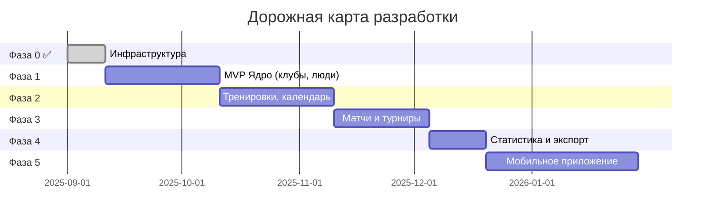

# Дорожная карта — «Сбор» (SquadUp.ru)

> MVP Web → MVP Mobile → Полная платформа v2.0

---

## Общая шкала времени

---

## Фаза 0: Подготовка инфраструктуры (2 недели) ✅ ВЫПОЛНЕНО

| Задача                                           | Длительность | Статус |
|--------------------------------------------------|--------------|--------|
| Инфраструктура: сервер, БД PostgreSQL, CI/CD, S3 | 10 дней      | ✅      |
| Laravel: структура проекта, Sanctum, роли, RBAC  | 8 дней       | ✅      |
| PostgreSQL: миграции Schema 1 + 2 + 3            | 5 дней       | ✅      |

**Результат:** Рабочий сервер с Laravel и настроенной БД. ✅

---

## Фаза 1: MVP — Клуб, команды, игроки (6 недель)

| Задача                                                    | Зависимость | Длительность | Статус |
|-----------------------------------------------------------|-------------|--------------|--------|
| API: Auth (email + OAuth Google/Apple)                    | Фаза 0      | 7 дней       | ⬜      |
| API: Клубы, команды (CRUD + лого → S3)                    | Auth        | 8 дней       | ⬜      |
| API: Игроки, тренеры, родители (CRUD + profiles)          | Клубы       | 10 дней      | ⬜      |
| API: Сезоны (CRUD, привязка к командам)                   | Клубы       | 5 дней       | ⬜      |
| API: Invite-ссылки (токен, роль, срок)                    | Профили     | 5 дней       | ⬜      |
| API: Импорт игроков из Excel/CSV                          | Профили     | 5 дней       | ⬜      |
| Веб: Регистрация, логин, выбор роли                       | Auth        | 10 дней      | ⬜      |
| Веб: Онбординг-визард (клуб → команды → тренеры → игроки) | Клубы API   | 10 дней      | ⬜      |
| Веб: Join Team (поиск + инвайт-код)                       | Invite API  | 5 дней       | ⬜      |
| Веб: Карточки игроков + состав команды                    | Профили API | 8 дней       | ⬜      |
| Email: Приглашения тренерам и родителям                   | Join Team   | 4 дня        | ⬜      |

**🎯 MVP 1 Milestone:** Клуб укомплектован — можно создать клуб, команды, добавить тренеров и игроков.

---

## Фаза 2: Тренировки, календарь, объявления (6 недель)

| Задача                                            | Зависимость    | Длительность | Статус |
|---------------------------------------------------|----------------|--------------|--------|
| API: Расписание тренировок (разовые + регулярные) | MVP 1          | 8 дней       | ⬜      |
| API: Посещаемость (RSVP + отметка тренером)       | Расписание     | 7 дней       | ⬜      |
| API: event_responses (полиморфный RSVP)           | Посещаемость   | 5 дней       | ⬜      |
| API: Авто-продление отсутствия (травма + срок)    | Посещаемость   | 4 дня        | ⬜      |
| Cron: Авто-генерация тренировок из шаблонов       | Расписание     | 4 дня        | ⬜      |
| API: Объявления (announcements — CRUD, приоритет) | MVP 1          | 5 дней       | ⬜      |
| Веб: Единый календарь (FullCalendar.js)           | Расписание API | 10 дней      | ⬜      |
| Веб: Дашборд — виджеты                            | Объявления API | 8 дней       | ⬜      |
| Веб: RSVP родителя + просмотр расписания          | Календарь      | 6 дней       | ⬜      |
| iCal: Экспорт в Google / Apple Calendar           | Календарь      | 4 дня        | ⬜      |
| Push/Telegram: Уведомления о тренировках          | RSVP           | 6 дней       | ⬜      |

**🎯 MVP 2 Milestone:** Тренировки + календарь работают — полный цикл планирования и RSVP.

---

## Фаза 3: Матчи и турниры (5 недель)

| Задача                                                     | Зависимость    | Длительность | Статус |
|------------------------------------------------------------|----------------|--------------|--------|
| API: Матчи (создание, состав, RSVP, score_home/score_away) | MVP 2          | 10 дней      | ⬜      |
| API: Два режима ввода счёта (авто/ручной)                  | Матчи API      | 4 дня        | ⬜      |
| API: Турниры (однодневный, регулярный, сетка)              | Матчи API      | 8 дней       | ⬜      |
| API: Live-матч (таймер, события, голы, карточки)           | Матчи API      | 7 дней       | ⬜      |
| Веб: Карточка матча + турнирная сетка + Home/Away          | Live API       | 10 дней      | ⬜      |
| Веб: RSVP на матч + live-экран (родитель/игрок)            | Карточка матча | 5 дней       | ⬜      |
| Push: Live-уведомления (гол, итог матча)                   | Live API       | 4 дня        | ⬜      |
| Веб: Danger Zone — каскадное удаление                      | RSVP матча     | 4 дня        | ⬜      |

**🎯 MVP 3 Milestone:** Матчи и турниры работают — полный игровой цикл.

---

## Фаза 4: Статистика, уведомления и экспорт (3 недели)

| Задача                                            | Зависимость    | Длительность | Статус |
|---------------------------------------------------|----------------|--------------|--------|
| API: Статистика игроков (голы, ассисты, посещ.)   | MVP 3          | 8 дней       | ⬜      |
| Веб: Страница статистики + экспорт Excel          | Статистика API | 7 дней       | ⬜      |
| Веб: Уведомления + настройки (все роли, timezone) | Статистика     | 5 дней       | ⬜      |

**🎯 MVP WEB Milestone:** Веб-версия MVP готова к пилоту!

---

## Фаза 5: Мобильное приложение (8 недель)

| Задача                                       | Зависимость | Длительность | Статус |
|----------------------------------------------|-------------|--------------|--------|
| Моб: Проект, архитектура, Auth + Deep Links  | MVP Web     | 10 дней      | ⬜      |
| Моб: Главный экран, профиль, настройки       | Архитектура | 7 дней       | ⬜      |
| Моб: Календарь тренировок + RSVP             | Профиль     | 10 дней      | ⬜      |
| Моб: Календарь матчей + RSVP + Live-экран    | Тренировки  | 10 дней      | ⬜      |
| Моб: Статистика игрока + профиль ребёнка     | Матчи       | 8 дней       | ⬜      |
| Моб: Push FCM/APNs + Offline-кэш SQLite/Hive | Статистика  | 10 дней      | ⬜      |
| Моб: QA + публикация App Store / Google Play | Offline-кэш | 7 дней       | ⬜      |

**🎯 MVP MOBILE Milestone:** Мобильное приложение v1.0 в сторах!

---

## Фаза 6: Расширенный функционал (backlog)

| Задача                                     | Зависимость | Длительность | Статус |
|--------------------------------------------|-------------|--------------|--------|
| Галерея: фото/видео тренировок и матчей    | MVP Mobile  | 12 дней      | ⬜      |
| Чат: тренер ↔ родители ↔ администратор     | Галерея     | 14 дней      | ⬜      |
| Авто-расчёт состава PlayOff по результатам | Чат         | 10 дней      | ⬜      |
| Несколько клубов / мультитенантность       | Чат         | 15 дней      | ⬜      |

**🎯 v2.0 Milestone:** Полная платформа — все фичи реализованы!

---

## Итоговые сроки

| Фаза                   | Длительность | Финиш     | Результат               |
|------------------------|--------------|-----------|-------------------------|
| Фаза 0: Инфраструктура | 2 недели     | Неделя 2  | Сервер + Laravel + БД   |
| Фаза 1: MVP Ядро       | 6 недель     | Неделя 8  | Клуб, команды, люди     |
| Фаза 2: Тренировки     | 6 недель     | Неделя 14 | Календарь + RSVP        |
| Фаза 3: Матчи          | 5 недель     | Неделя 19 | Live-матчи, турниры     |
| Фаза 4: Статистика     | 3 недели     | Неделя 22 | **MVP Web готов**       |
| Фаза 5: Мобильное      | 8 недель     | Неделя 30 | **MVP Mobile в сторах** |
| Фаза 6: Расширения     | backlog      | —         | Полная платформа v2.0   |

---

*Документ создан: 2026-03-10*
*Последнее обновление: 2026-03-10*
